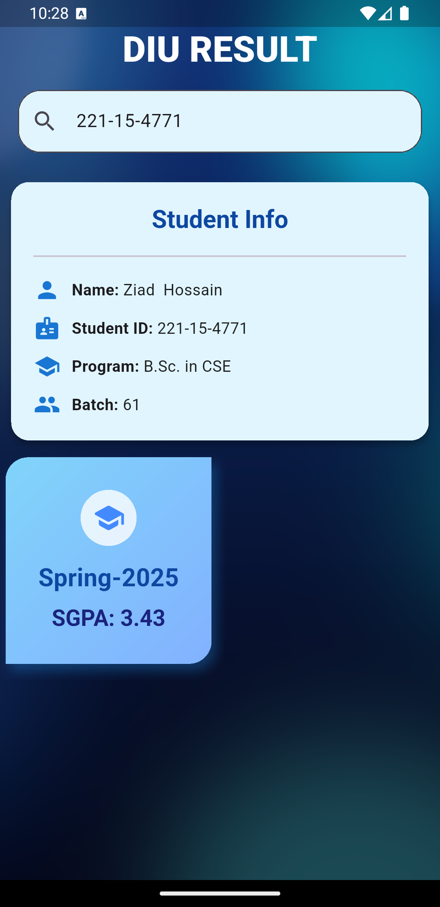
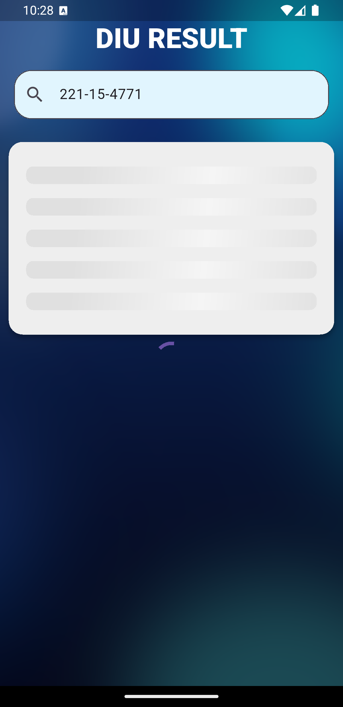
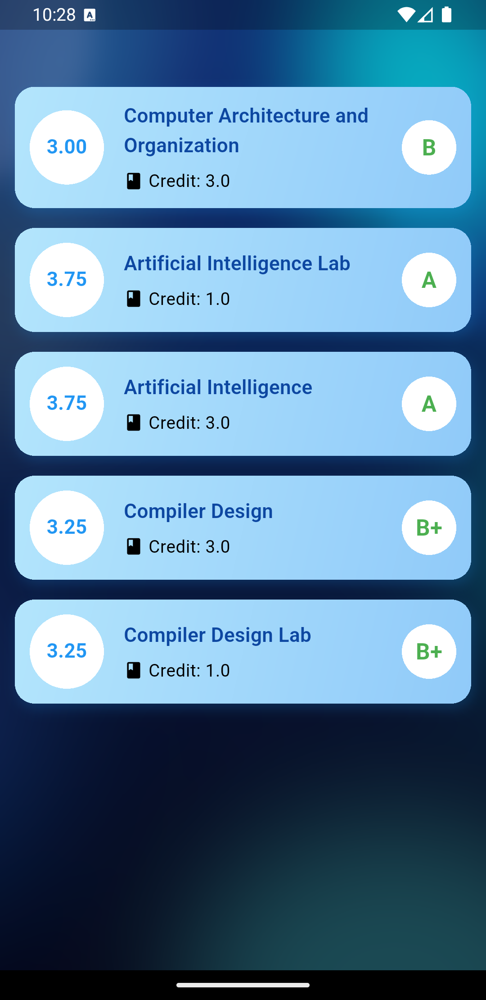

# 📘 DIU Result App

The **DIU Result App** is a Flutter-based mobile application developed to help students of **Daffodil International University (DIU)** conveniently access their academic results. The app connects to DIU’s open APIs and displays student details and semester-wise results in real-time.

---

## ✨ Features

- 🔍 **Search by Student ID**  
  Easily fetch your academic data by entering your unique DIU student ID.

- 👤 **Student Information Display**  
  View your name, ID, batch, department, and program.

- 📊 **Semester Results**  
  Check your semester-wise CGPA and course-wise grades.

- ✨ **Shimmer Loading Effects**  
  Enjoy a smooth UI experience with shimmer effects during data loading.

- 📱 **Responsive UI**  
  Fully optimized for mobile and tablet screens.

- ⚡ **GetX State Management**  
  Lightweight and reactive UI powered by the GetX framework.

---

## 🛠️ Technologies Used

| Technology | Description |
|------------|-------------|
| [Flutter](https://flutter.dev/) | Cross-platform mobile app framework |
| [GetX](https://pub.dev/packages/get) | State management, routing, and dependency injection |
| [Shimmer](https://pub.dev/packages/shimmer) | Beautiful shimmer loading effect |
| **DIU Open APIs** | Public APIs for accessing DIU student and result data |

---

## 📸 Screenshots

| Home Screen | Loading Screen | Result Screen |
|-------------|----------------|---------------|
|  |  |  |
| Enter Student ID | Shimmer loading while fetching data | Semester results displayed |

---

## 🚀 Installation

Follow these steps to set up the project:

```bash
# 1. Clone the repository
git clone https://github.com/yourusername/diu-result-app.git
cd diu-result-app

# 2. Install dependencies
flutter pub get

# 3. (Optional) Configure DIU API
#    Make sure you have the required API access or keys if needed.

# 4. Run the app
flutter run


⸻

🧑‍💻 Usage
	1.	Launch the app.
	2.	Enter your student ID on the home screen.
	3.	Tap the search button.
	4.	View your student details and semester-wise CGPA.
	5.	Enjoy real-time data fetching with a smooth shimmer loading effect.

⸻

🤝 Contributing

Contributions are welcome!
To contribute:
	1.	Fork the repository
	2.	Create a new branch (git checkout -b feature-name)
	3.	Commit your changes (git commit -am 'Add feature')
	4.	Push to the branch (git push origin feature-name)
	5.	Create a Pull Request

Please follow the existing coding style and include tests if necessary.

⸻

📄 License

This project is licensed under the MIT License.
See the LICENSE file for details.

⸻

🙏 Acknowledgement

Special thanks to Daffodil International University for providing open APIs that enable this application.

⸻

✅ Assets Setup

Save your screenshots as:
	•	assets/s1.png → Home screen
	•	assets/s2.png → Loading/shimmer screen
	•	assets/s3.png → Result screen

Add them in your pubspec.yaml:

flutter:
  assets:
    - assets/s1.png
    - assets/s2.png
    - assets/s3.png
